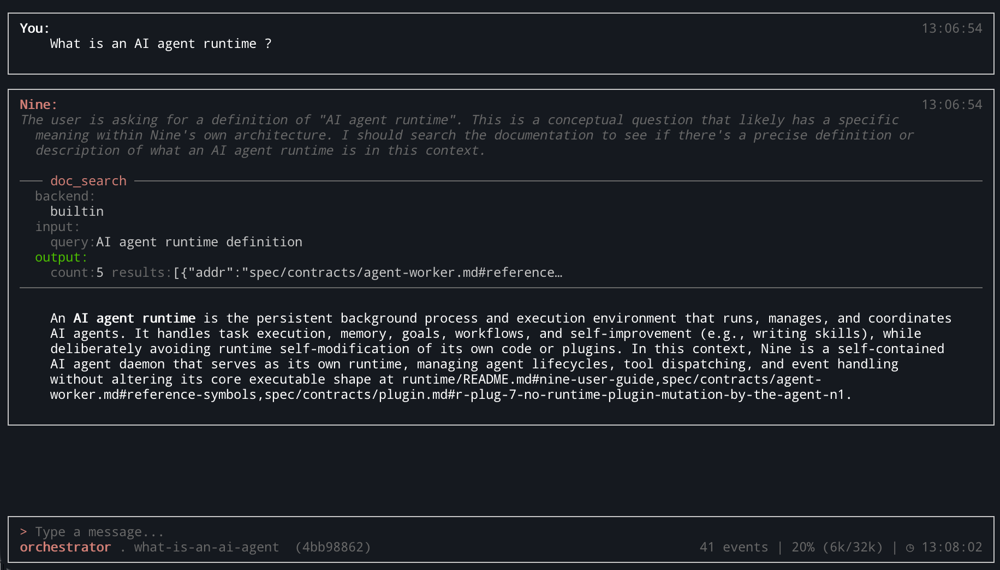
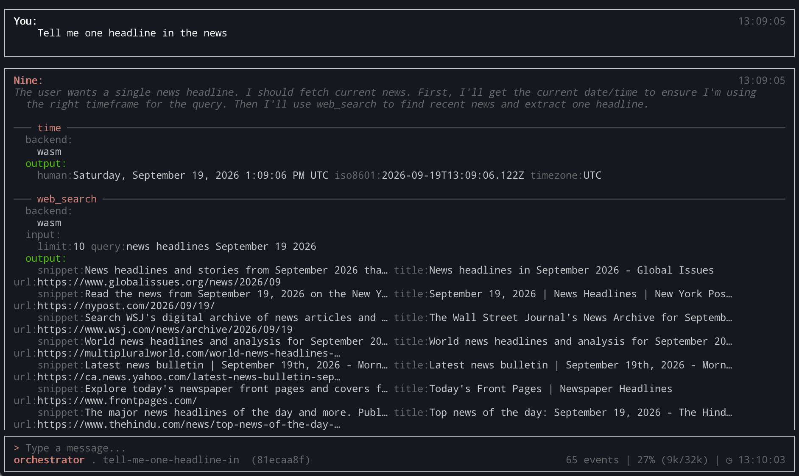
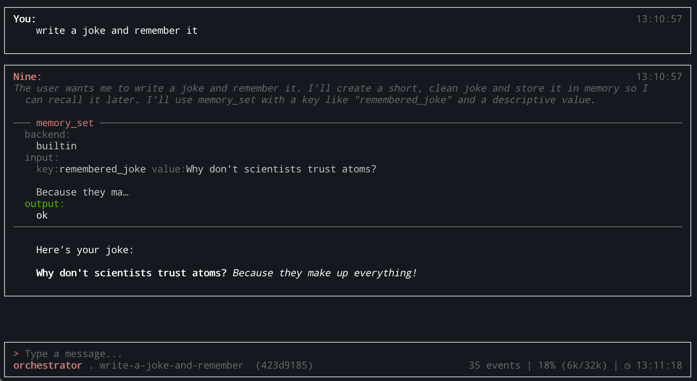
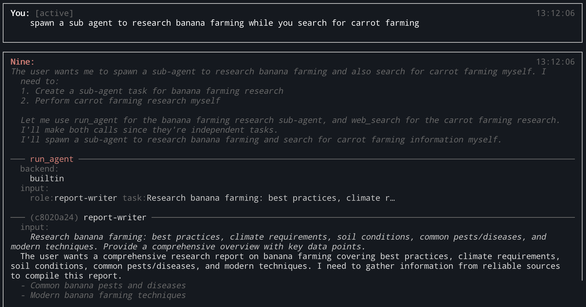

# Nine
```
 ███╗   ██╗██╗███╗   ██╗███████╗
 ████╗  ██║██║████╗  ██║██╔════╝
 ██╔██╗ ██║██║██╔██╗ ██║█████╗
 ██║╚██╗██║██║██║╚██╗██║██╔══╝
 ██║ ╚████║██║██║ ╚████║███████╗
 ╚═╝  ╚═══╝╚═╝╚═╝  ╚═══╝╚══════╝
```
[](LICENSE)
[](go.mod)
[](#project-status)
[](https://github.com/djordlucas/nine/pkgs/container/nine)

Nine is an **AI agent runtime**.
Use Nine to research subjects, work on codebases, automate processes, experiment.
Anything that computing resources can reach is something Nine can be pointed at.
Nine is developed against small models as a baseline.

It ships as a single binary (Docker, Linux, Mac OS) that implements client, server and plugins roles at once.
Each Nine session runs a dedicated agent loop that can plan work, do tool calls, persist data and
orchestrate sub-agent loops, interactively via the TUI or in the background through scheduled and
periodic goals. Everything — conversations, goals, memories, session events — lives in one SQLite file.

Nine is:

**Modular.** Built-in tools (http, fs, shell, time), custom plugins, MCP, WASM and JS tools all
reach the agent through one dispatcher, backed by in-process core tools, native plugins over a Unix
socket, external MCP servers, and agent- or user-supplied JS/Wasm code. Roles gate which of them a
given worker may call.

**Persistent.** State is not a process that dies with your terminal. Conversations, goals, workflows,
memory, files, skills and generated tools live in a database file, and every turn is checkpointed —
kill the daemon mid-task and it resumes with the same history and plan. The model reaches that state
through ordinary tools: key/value memory, durable file storage, and text/semantic search over it.

**Autonomous.** Sessions can also continue — or start — without user supervision. Given a goal, Nine
spawns a background session that wakes on an interval to push it forward. **Standing agents** declared
in `nine.toml` skip the human entirely: cron-scheduled, narrowly tool-scoped, surfacing findings to
`nine notifications`. Background work always runs at lower priority than your active conversation.

**Auditable.** An append-only journal records every step the agent has ever taken — turn boundaries,
the exact LLM request/response, tool I/O, context usage, sub-agent lifecycle. `nine trace` and
`nine replay` read it back; `nine context` shows the session's current context.

**Evolving.** Nine writes its own skills — markdown how-to notes, retrieved into context when relevant.
Where enabled, it also writes its own sandboxed tools at runtime (JS/Wasm) to close capability gaps:
the agent writes the code, the operator writes the capability grants.

**Local.** Built to run against a local model (currently through Ollama) with a SQLite database,
developed against small models to stay useful on modest hardware. Currently tested against
`qwen3.5:4b`, `qwen3.5:9b`, `gemma4:e4b` and `gemma4:e2b` on a 16 GB M4
([model compatibility](docs/model-compatibility.md)).

## Screenshots

<table>
<tr>
<td></td>
<td></td>
</tr>
<tr>
<td></td>
<td></td>
</tr>
</table>

## Key concepts
| Concept | Description |
|---------|-------------|
| **UI** | CLI or TUI, both thin clients over the daemon's Unix socket |
| **Daemon** | Long-running background process; manages agents, plugins and state |
| **Agent** | An LLM agent running the ReAct loop |
| **Plugin** | A tool container — a standalone binary, or an MCP server |
| **Sandboxed tool** | User supplied JS or wasm run in-process in a wasm sandbox (Wazero), through capabilities grants |
| **Generated tool** | A sandboxed tool Nine wrote itself, stored as a row; its code is the agent's, its capabilities the operator's |
| **Capability** | A conferred reach — `fs`, `env`, `net.http` — declared by a tool's manifest and granted only in `nine.toml` |
| **Skill** | Markdown how-to note, semantically retrieved into context |
| **Goal** | An open-ended intention with no end condition, pursued in the background |
| **Workflow** | A finite multi-step plan for sub-agent delegation |
| **Session plan** | The stages and idle schedule that let a session wake and take its own next turn |
| **Standing agent** | A goal declared in `nine.toml`; runs from boot on a cron schedule, no human turn needed |
| **Supervisor** | Special agent that monitors others for stalls and capability gaps |
| **Checkpoint** | Serialized agent state persisted to the database |
| **Journal** | Append-only record of every step |

## Quick start

No clone needed — the image ships a working config. The image is private, so
authenticate first with a GitHub token carrying `read:packages`.

```bash
# 1. Registry access and a model on the host
echo "$CR_PAT" | docker login ghcr.io -u <your-github-username> --password-stdin
ollama pull qwen3.5:4b

# 2. Nine
docker run -d --name nine \
  -p 127.0.0.1:8080:8080 \
  --add-host host.docker.internal:host-gateway \
  -v nine-data:/data \
  ghcr.io/djordlucas/nine:latest

# 3. A session
docker exec -it -u nine nine nine
```

Published for `linux/amd64` and `linux/arm64`. Registry access, tags, signature
verification and the configuration surface:
[docs/docker-image.md](docs/docker-image.md).

Point Nine at a different LLM without a config file:

```bash
docker run -d --name nine \
  -e NINE_LLM_ENDPOINT=http://192.168.1.10:11434 \
  -e NINE_LLM_MODEL=qwen3.5:9b \
  -v nine-data:/data \
  ghcr.io/djordlucas/nine:latest
```

Verify what you pulled before running it:

```bash
cosign verify ghcr.io/djordlucas/nine:latest \
  --certificate-identity-regexp '^https://github.com/djordlucas/nine/.github/workflows/release-image.yml@' \
  --certificate-oidc-issuer https://token.actions.githubusercontent.com
```

### From a clone

For hacking on Nine, or to build the image yourself:

```bash
git clone https://github.com/djordlucas/nine
cd nine
make up        # build and run the runtime image
make session   # interactive TUI session
```

`make up` mounts the repo's own `nine.toml`, which is a development config —
sandboxed tools on, paths in the source tree. The published image's baked config
is narrower. See [Installation](#installation) for the native build,
prerequisites, and the full Makefile target list.

## Installation

### Prerequisites

| Requirement | Version | Notes |
|-------------|---------|-------|
| Go | 1.26+ | Native build |
| Node.js | 18+ | Optional — only for `npx`-launched MCP servers |
| Docker | 24+ | Container build (one container, no compose) |
| golangci-lint | latest | Optional, for `make lint` |

Plus a running [Ollama](https://ollama.com) with a model pulled.

Sandboxed tools need nothing extra to run: the QuickJS interpreter they execute on is
committed to the repo as a pre-built wasm artifact with a recorded SHA-256, and the
wasm runtime and JS bundler are pure-Go libraries. Rebuilding that interpreter
(`make quickjs-wasm`) is a separate step and the only thing that wants a
wasi-sdk; `make quickjs-verify` re-checks the committed hash.

### Build from source

```bash
git clone https://github.com/djordlucas/nine
cd nine
make all
```

**Nine ships as a single binary.** That build produces exactly one file, `dist/nine`,
and it is everything: the CLI, the TUI, the daemon, and the four built-in plugins.
Deploying Nine is copying one file.

Nine looks for its config, in order: `$NINE_CONFIG`, `./nine.toml`, `/nine.toml`,
then `~/.nine/nine.toml`. The repo's `nine.toml` works as-is against a local Ollama;
the database is created on first run at `~/.nine/nine.db`.

### Docker (single container)

The deployment unit is **one container** running the daemon under s6-overlay
([adr/single-container.md](adr/single-container.md)). Its database is a file on
the `/data` volume, so there is no second service to orchestrate and no
docker-compose file.

Most people should pull the published image rather than build one — see
[Quick start](#quick-start) and [docs/docker-image.md](docs/docker-image.md).
The targets below build it locally from a clone:

```bash
make up                # built runtime image
make up-hot            # hot-reload: rebuilds and restarts the daemon on any .go change
make down              # stop, keeping all data
make destroy           # remove everything, including all data volumes and images

make image             # build the runtime image exactly as a release does
make image-test        # assert the image contract (non-root, no toolchain, versions)
make image-scan        # the same Trivy gate CI applies before a push
make image-verify      # verify a published image's cosign signature
```

The runtime image holds the compiled binary, the plugins, and the built-in skills
— no Go toolchain, no Node, no npm, and no source tree. Nine does not build
native code at runtime, and sandboxed tools do not change that: the wasm interpreter
and the JS bundler are both compiled in. Hot-reload mode bind-mounts the source and rebuilds
via `inotifywait` — this is the development path. Neither image ships a browser (the
dev image does carry Node for `npx` MCP servers), and `tools.d/` is mounted at
`/tools.d` — though the subsystem still needs
`[tools] enabled = true` in the `nine.toml` you mount, which no environment variable
can flip on.

That is the container's whole configuration story: it reuses the same `nine.toml`
written for the native layout, and overrides the handful of values that differ —
LLM endpoint, database path, plugin and workspace paths — through environment variables
rather than a second config file. Those overrides win over the file. The most useful:

| Variable | Description |
|----------|-------------|
| `NINE_CONFIG` | Explicit config path, skipping the search order |
| `NINE_LLM_PROVIDER` / `NINE_LLM_MODEL` / `NINE_LLM_ENDPOINT` | Override the LLM without editing config |
| `NINE_DB_PATH` | Override the database file path |
| `NINE_PLUGINS_BIN` / `NINE_WORKSPACE_ROOT` | Override the plugin and workspace paths (how the container reuses `nine.toml`) |
| `NINE_TOOLS_USER_DIR` | Override the sandboxed-tool directory. Deliberately the *only* tool override — whether the subsystem runs at all stays in `nine.toml` |
| `SEARCH_PROVIDER` / `SEARCH_API_KEY` | `web_search` backend: `brave` or `serpapi`. Unset uses DuckDuckGo, no key needed. |
| `NINE_LOG_LEVEL` / `NINE_LOG_FORMAT` | `debug`/`info`/`warn`/`error`; `text`/`json` |

Configuration belongs to the operator, not the agent: Nine cannot rewrite `nine.toml`
at runtime. Change a setting by editing the file and restarting the daemon. Full
reference: [docs/configuration.md](docs/configuration.md).

The full Makefile target list is in [docs/installation.md](docs/installation.md).

## Architecture
Nine is a daemon/client pair. The CLI is thin — it opens a Unix socket, sends a
message, prints the reply. Everything long-lived is in the daemon.

```
┌─────────────────────────────────────────────────────┐
│  nine <message>  (CLI client)                       │
│  Connects to Unix socket, sends message,            |
|  prints reply                                       │
└─────────────────┬───────────────────────────────────┘
                  │ JSON over Unix socket
┌─────────────────▼───────────────────────────────────┐
│  Daemon                                             │
│  ┌──────────────┐   ┌───────────────┐               │
│  │ Conversation │   │  Supervisor   │               │
│  │  Manager     │   │  Agent        │               │
│  └──────┬───────┘   └───────┬───────┘               │
│         │ spawns many       │ monitors              │
│  ┌──────▼───────────────────▼───────┐               │
│  │           Agent Loops            |               |
|  |          Builds context          |               |
|  |      Uses roles, skills, tools   │               │
│  │  (ReAct: reason → act → observe) │               │
│  └──────────────┬───────────────────┘               │
│                 │                                   │
│  ┌──────────────▼───────────────────┐               │
│  │         LLM Queue                │               │
│  │  priority: supervisor > active   │               │
│  │           > background           │               │
│  └──────────────┬───────────────────┘               │
│                 │                                   │
│  ┌──────────────▼───────────────────┐               │
│  │         LLM Provider             │               │
│  │  (Ollama)                        │               │
│  └──────────────────────────────────┘               │
│                                                     │
│  ┌────────────────────────────────────────────────┐ │
│  │  Tool Dispatcher                               │ │
│  │  ┌──────────────────┐  ┌─────────────────────┐ │ │
│  │  │ Plugin Manager   │  │ Sandboxed Tool Host │ │ │
│  │  │ shell files http │  │ wasm, in-process    │ │ │
│  │  │ time mcp:*       │  │ tools.d + generated │ │ │
│  │  │ (subprocesses,   │  │ (capabilities are   │ │ │
│  │  │  unix sockets)   │  │  conferred by cfg)  │ │ │
│  │  └──────────────────┘  └─────────────────────┘ │ │
│  └────────────────────────────────────────────────┘ │
│                                                     │
│  ┌────────────────────────────────────────────────┐ │
│  │  memory.Store  →  SQLite (one file)            │ │
│  │  (in-process; all durable state + the event    │ │
│  │   journal; memory/file/skill tools are core,   │ │
│  │   not plugins)                                 │ │
│  └────────────────────────────────────────────────┘ │
└─────────────────────────────────────────────────────┘
```

**The agent loop** implements ReAct: assemble the turn, submit to the LLM queue, then
either dispatch the returned tool calls and loop, or commit a final answer and
checkpoint. A scratchpad accumulates tool calls and their output within a turn.

**The context builder** treats context as a budget rather than a buffer. Sources
compete by priority — system prompt, then tool definitions, self-model, enrichment,
message history, scratchpad — and the low-priority ones are trimmed or dropped when
the budget is tight. Tool definitions are capped at top-N and ranked by cosine
similarity between your query and each tool's description embedding, so the model
sees the tools that matter for *this* turn instead of all of them.

**The LLM queue** serializes requests across every concurrent agent, prioritizing the
supervisor above active conversations above background work, so a goal grinding away
in the background never makes you wait.

**The tool dispatcher** is the single place a tool name resolves to an implementation,
and it has three backends behind one namespace: core-intercepted tools calling the
store in-process, plugin subprocesses, and the wasm sandbox host. A name resolves to
exactly one of them — an unexpected collision is a load failure, not a silent override.

**Memory** is one SQLite file, reached through a single store.
Schema is applied idempotently on open. Tables cover conversations, goals, workflows,
KV memory, full-text-searchable files, vectors, skills, generated tools, session plans,
human-in-the-loop state, and the event journal.
Operational tables are daemon-private — never exposed to the agent as tools — so an
agent cannot reach in and rewrite its own goal state; what it can reach, it reaches
through ordinary tools.

**The event journal** records every session's trajectory: turn boundaries, exact LLM
request and response, tool I/O with latency and errors, context usage, sub-agent
lifecycle. It is written off the turn's critical path by an async batched sink.
It is also subscribable, with durable per-subscriber cursors;
the current and first subscriber links topically-similar sessions so a later turn
can pull relevant prior context in.

**Orchestration: goals and workflows.** A workflow is a finite, in-session multi-step
plan with dependency gating and auto-close that agents generate and follow. A goal is
open-ended with no end condition — "monitor this repo for security issues" — and each
top-level goal gets a background session that wakes every five minutes to make progress
on it.

The full treatment — topology, concurrency, the turn lifecycle, boot sequence, and the
invariants that hold it together — is in [docs/architecture.md](docs/architecture.md).

## Plugins
Plugins are tool containers. A plugin advertises the tools it supports and in turn
Nine advertises the tools to the model. By adding plugins, users can add functionality.
Plugins may run asynchronous jobs — the plugin protocol supports it.

Nine ships four plugins — `shell`, `files`, `http`, and `time`. They are served out of
the `nine` binary itself: the daemon starts each by re-executing itself as
`nine plugin serve <name>`, so they keep their own process and crash isolation without
their own artifact. A crashing plugin cannot take the daemon or an active conversation
down with it.

Beyond those, an **MCP server** declared as an `[[mcp.server]]` becomes a plugin too —
its own process, its own roster row, tools prefixed with the server's name. That is how
Nine drives a browser: see [docs/browser.md](docs/browser.md). Each MCP server gets its
own nine process bridging to it.

In contrast, memory, durable file storage, semantic search, and skills are **not**
plugins — they are core tools, wired into the agent loop and calling the store
in-process. They are still ordinary tools from the model's side.

Sandboxed tools (below) are a *second backend behind the same dispatcher*, not a
replacement: the plugin protocol, transport, and lifecycle are untouched.

### Writing one

A plugin is any executable that answers two methods over HTTP on a Unix socket:

`plugin.describe`, called once at startup, advertises the tools:

```json
{
  "result": {
    "protocol_version": 1,
    "max_concurrent": 0,
    "tools": [
      {
        "name": "my_tool",
        "description": "Does something useful",
        "inputSchema": {
          "type": "object",
          "properties": {"input": {"type": "string", "description": "The input value"}},
          "required": ["input"]
        }
      }
    ]
  }
}
```

The description string matters; it is what gets embedded and ranked for tool selection,
so it determines whether your tool is offered to the model at all.

`plugin.call` runs one invocation:

```json
{"method": "plugin.call", "params": {"tool": "my_tool", "args": {"input": "hello"}}}
→ {"result": {"output": "hello, world"}}
```

The daemon spawns the plugin process with `NINE_PLUGIN_SOCKET` set; `plugin.Serve` listens there and
handles `POST /rpc`. HTTP gives per-request concurrency, pooling, and cancellation
via `context`.

- The envelope is `{"method": ..., "params": ...}`
- The reply is `{"result": ...}` or `{"error": {"code": ..., "message": ...}}`

To add a plugin, drop the custom built binary beside a manifest in
`[plugins].user_dir` (`plugins.d/weather` + `plugins.d/weather.toml`),
which the daemon discovers at boot and re-scans on `nine plugins reload`.
External MCP servers are supported as an exception, speaking JSON-RPC 2.0 over stdio.

See [docs/plugins.md](docs/plugins.md) and [docs/plugins-http-transport.md](docs/plugins-http-transport.md).

## Sandboxed tools
Sandboxed tools are three files you drop in a directory — two if the tool takes no
arguments. The daemon runs them in a wasm sandbox, in-process, with exactly the
capabilities the operator granted; by default, **none**. No subprocess, no compile step,
no image rebuild. Capabilities (fs, http) are exposed from the host — Nine itself —
through wasm exports.

```text
tools.d/
  csvstats.toml        # the manifest — the gate
  csvstats.schema.json # the argument schema
  csvstats.js          # the code
```

A `.js` or `.wasm` file with no manifest beside it is never loaded. The subsystem is
**off until you turn it on**:

```toml
[tools]
enabled  = true
user_dir = "./tools.d"
```

The code default-exports a function; return a string and it reaches the model
untouched, return anything else and it is JSON-stringified, throw and the model reads
your message as an ordinary tool failure and can retry.

```js
// csvstats.js
export default ({ csv }) => {
  const rows = csv.trim().split("\n").map((line) => line.split(","));
  return { rows: rows.length, columns: rows[0]?.length ?? 0 };
};
```

The manifest beside it is authoritative — `name`, `description`, and `input_schema` all
live there, so it is where the model's view of the tool comes from:

```toml
# csvstats.toml
name         = "csv_stats"
kind         = "js"              # "js" or "wasm"
entrypoint   = "./csvstats.js"
description  = "Summary statistics over a CSV string."
input_schema = "./csvstats.schema.json"
```

An unknown key is an error rather than a warning. The tool's name shares one namespace
with built-ins and plugin tools, and a collision skips your tool rather than overriding theirs.

The `js` kind runs on a pre-supplied, trimmed QuickJS-NG interpreter compiled to wasm:
**ES2023 and nothing else** — no Node standard library, no `require`, no `setTimeout`
and no `URL`, and `fetch` only where `net.http` was granted. Bundle your dependencies
at development time (`npx esbuild … --bundle --format=esm --platform=neutral`); an
`import` left in a developer tool's file fails at call time. For another language or
full speed, ship a `.wasm` module directly from Rust, TinyGo, Zig, or C, exporting the
two-function ABI (`nine_alloc`, `nine_run`) that passes UTF-8 JSON in and out.

### Capabilities

The manifest **declares a need**; only `nine.toml` **grants** it. The two must match
exactly — declaring something ungranted fails to load, and being granted something not
declared also fails to load the tool.

```toml
# csvstats.toml — the tool declares a need
[capabilities]
fs = ["read"]

# nine.toml — the operator grants it, by name
[tool.csv_stats.capabilities.fs]
read = [{ host = "/srv/data", guest = "/data" }]
```

Your code sees the **guest** path (`/data`), so an operator can narrow or move the mount
without your tool changing.

| Capability | You get | Default |
|---|---|---|
| `clock`, `random`, `log` | `Date.now()`, `Math.random()`, `console.*` | granted |
| `fs.read` / `fs.write` | mounted directories, addressed by their *guest* path | declare + grant |
| `env` | named keys only (`NINE_*` and `*_API_KEY` can never be granted) | declare + grant |
| `net.http` | a `fetch` subset | declare + grant |

Everything with reach starts at nothing. A capability is either a wazero pre-open or a
host function the daemon exports, so anything else is not "denied" but structurally
absent: a sandboxed tool cannot spawn a process, open a socket, load a native library,
or call another tool.

`net.http` is the exception — wazero has no network, so it is a host function and its
security is Nine's problem. Two gates must both pass: the hostname matches the tool's
`allow_hosts`, **and** the address being dialed is publicly routable, checked
immediately before connect so there is no window to re-resolve into. Loopback,
link-local (including the cloud metadata address `169.254.169.254`), and RFC 1918 are
refused on every redirect hop regardless of the allowlist, `Authorization`/`Cookie` are
stripped across origins. A bare `"*"` in `allow_hosts` grants any host and still no
address — the second gate is not subject to the allowlist.

Bounds are always on: **one instance per call** (no global, no cache, no credential
survives a call), a 5s wall clock, and 16 MiB — the last two operator-tunable. wazero
has no fuel metering, so the deadline is the only CPU bound.

### The tier Nine writes itself

Nine can also write its own tools at runtime — the gap its `gap_report` names but
could not previously close. These are rows in the store rather than files on disk, but
they run in the identical sandbox under the identical rules. The tier is currently off by
default and independent of `[tools] enabled`; with it off, `tool_write`, `tool_delete`,
and `js_eval` are neither registered nor advertised, and a loop is identical to one
built before the tier existed:

```toml
[tools.agent]
enabled          = true
eval             = true             # allow js_eval — run a snippet, persist nothing
max_tools        = 64               # catalog cap; least-recently-called are evicted
require_approval = "on_capability"  # prompt a human only when a tool asks for reach

[tools.agent.capabilities.fs]       # the ceiling, not a grant
read = [{ host = "${NINE_WORKSPACE}", guest = "/workspace" }]
```

`[tools.agent.capabilities]` is a **ceiling**: the most any generated tool may be
granted, never an automatic grant. A tool gets a capability only by declaring it, one
that declares nothing runs with nothing, and declaring past the ceiling is a refusal
the model can act on. Declarations are re-resolved on every load, so narrowing the
ceiling disables a tool that no longer fits rather than leaving it running with reach
you withdrew.

This is the boundary, stated precisely: **the agent writes the code, the operator
writes the grants.** `tool_write` writes JavaScript and a capability *declaration*.
It has no path to write a grant. Nine gains one column and never the other:

| | Code | Capabilities |
|---|---|---|
| Native plugin | operator (build time) | operator (`nine.toml`) |
| Developer sandboxed tool | developer (file on disk) | operator (`nine.toml`) |
| Generated sandboxed tool | **Nine** (runtime) | operator (`nine.toml`) |

Generated tools may always import a small vendored standard library — `nine:csv`,
`nine:date`, `nine:diff` — embedded in the binary, no config and no network. External
npm packages are a separate switch, off by default: `tool_write` resolves the permitted
imports **once, at write time, in the daemon**, verifies each tarball against its
published checksum, runs no install scripts, and inlines the result, so by call time the
tool has no imports left and no way to reach the network. A tool that both declares
`net.http` and pulls a dependency is refused unless the operator lifts an explicit
interlock.

A write can be gated on a human: `require_approval` defaults to `on_capability`,
prompting only when the proposed tool declares reach (`always` and `never` are the other
two; gates apply to interactive sessions only). The catalog is capped at `max_tools`
with least-recently-called eviction, since every generated tool competes for the same
tool-ranking budget.

Writes and deletes are journalled per session and additionally logged as an operator
breadcrumb; `js_eval` runs a snippet under the same rules and persists nothing, so
iteration does not accrete single-use tools. A new tool is visible **next turn** —
loops already in flight keep the tool set they started with.

### Seeing what happened

```console
$ nine tools
  ok    csv_stats          js     fs.read /srv/data=>/data
  ok    weather            js     net.http GET api.weather.example
  ok    due_date           gen    none
  SKIP  scraper            js     capability fs.read is declared by the tool but not granted; add it
                                  under [tool.<name>.capabilities] or remove the declaration
```

A tool that fails to load is always reported with its reason — that is the point of the
surface, and the `gen` column marks a tool as Nine's own rather than yours.
`nine tools show <name>` prints one in full — provenance, resolved grant, manifest path
or store origin, dependencies; `nine tools deps` answers "what third-party code is in
this daemon, and which tool pulled it in"; `nine tools reload` re-scans the directory
live; and `nine tool validate [path]` checks a manifest, entrypoint, schema, and ABI
exports with no daemon running.

The authoring guide is [docs/writing-sandboxed-tools.md](docs/writing-sandboxed-tools.md);
the design rationale and the capability model in full are in
[docs/sandboxed-tools.md](docs/sandboxed-tools.md), with the normative contract in
`spec/contracts/toolvm.md` (`nine spec toolvm`).

## Skills
Skills are how Nine improves what it *knows*; generated tools, where an operator turned
that tier on, are how it improves what it can *do*. A skill is a markdown how-to note
with YAML frontmatter, stored in the database:

```markdown
---
name: git-workflow
description: Best practices for Git branching, committing, and pull requests
tags: [git, version-control, workflow]
---
```

The description is embedded into a vector namespace. When a skill is semantically
relevant to the task at hand, its *name* surfaces into the agent's self-model, and the
agent reads the body on demand — on-demand documentation rather than permanent context
tax. Built-in skills are embedded in the binary and seeded into the database on every
boot, so editing one and rebuilding updates it; skills the agent wrote itself are left
alone.

The boundary is deliberate: Nine writes skills, and sandboxed-tool code where the
operator enabled that tier — both of which are store state, listable and deletable
like a goal or a workflow. It does not generate plugins, write itself a capability
grant (yet), rewrite its config, or rebuild its source at runtime. See:
[docs/self-modification.md](docs/self-modification.md).

## Documentation
The documentation and specs live in this repo and inside the binary, rendered as
markdown when invoked:

```
nine docs [topic] Show bundled documentation (no topic lists them)
nine spec [topic] Show a bundled specification (no topic lists them)
```

[docs/README.md](docs/README.md) is the full guide, ordered for a first-time reader.
Highlights:

- [CLI usage](docs/usage.md) — commands, TUI, slash commands, background tasks
- [Agent loop](docs/agent-loop.md) and [context builder](docs/context-builder.md)
- [The event journal](docs/event-journal.md) — the record of every exchange, and subscribing to it
- [Session plans & routines](docs/session-plans.md) — idle scheduling, reflection, goal pursuit
- [Roles](docs/roles.md) — role-gated tool allowlists, delegation, depth guards
- [Writing sandboxed tools](docs/writing-sandboxed-tools.md) and the
  [design behind them](docs/sandboxed-tools.md) — the wasm host and its capability model
- [Predefined agents](docs/predefined-agents.md) and [scheduling](docs/scheduling.md)
- [Human-in-the-loop](docs/hitl.md) — `ask_human` and approval gates
- [Glossary](docs/glossary.md) — every concept in one place

## Project status
**Experimental, stabilizing.**
Interfaces change without notice, there is no support promise or stability guarantee.
It is under active development, and tested — but not yet tested heavily.

Every feature lands with tests: unit tests, hermetic harness tests for the daemon and
its wire protocol, integration tests against a real container and a real model, and an
eval suite that both replays recorded sessions deterministically and runs a live-model
matrix ([docs/evals.md](docs/evals.md),
[model compatibility](docs/model-compatibility.md)). What that does not yet buy is
user mileage. The failure modes that only long uninterrupted runs, unusual hardware,
or an unfamiliar model turn up are still ahead of it.
Expect rough edges in that territory — please open an issue when you hit one.

See [Contributing](#contributing) before opening a pull request.

## Roadmap
Planned work, undated, landing in whatever order makes sense. Shipped items are
removed from this table rather than marked done.

| Item | Status | Detail |
|------|--------|--------|
| Hardening | Planned | Nine is not hardened. See [Limits](#limits) for what that means today. |
| REST API / remote access | Planned | The daemon speaks newline-delimited JSON over a Unix socket, so every client must be on the same host. HTTP would open conversations, goals, workflows and the journal to a browser UI, a phone, or another machine. Lands with the hardening work, because it brings authentication and transport security with it. |
| Model routing | Planned | Route different work to different models in one deployment. Nine uses one model at a time. |
| More LLM backends | Partial | Mistral is supported. llama.cpp and vLLM both speak an OpenAI-compatible API, so one adapter covers them. |
| Richer sandboxed tools | Planned | FS and env gaps, runtime wasm grants, binary data, missing JS globals, per-tool timeouts, HTTP audit, secret sharing, CLI commands, structured tool errors. |
| TUI improvements | Partial | Slash-command views are read-only, and the journal, notifications, and moving background sessions have no place in the TUI. Migrated to charm.land v2 (bubbletea, lipgloss, bubbles, glamour). |
| More built-in plugins | Planned | — |
| Codebase improvements | Planned | Refactoring and performance work — [`adr/codebase-improvement.md`](adr/codebase-improvement.md). |
| Re-enable CodeQL scanning | Blocked | CodeQL and SARIF upload need a public repository or GitHub Advanced Security. Re-add the CodeQL job and the Trivy `upload-sarif` steps once this repo is public. |
| Fix eval-runner daemon hang | Planned | `tests/evals/runner` spins up a real in-process daemon per test and intermittently deadlocks under CI load on a turn whose reply never arrives. Excluded from the CI gate until fixed; `make eval-replay` still runs. |

## Limits
| Limit | Detail |
|-------|--------|
| Not hardened | Only sandboxed tools run behind a real boundary. The `shell` plugin and native plugins run as the daemon's process user with its full filesystem and network reach. In the published image that user is an unprivileged uid 1000, so the reach stops at the container. |
| No API authentication | Port 8080 speaks to whoever reaches it. Bind it to localhost or front it with a proxy. |
| Single host | The daemon listens on a Unix socket, so every client runs on the same machine. No authentication, no transport security. |
| One model at a time | No routing across models within a deployment. |
| Ollama and Mistral only | Other providers are refused at startup rather than falling back. |
| Small-model baseline | Tested against `qwen3.5:4b`, `qwen3.5:9b`, `gemma4:e4b` and `gemma4:e2b` on a 16 GB M4. Behavior on large hosted models is unmeasured — [model compatibility](docs/model-compatibility.md). |
| Interfaces change without notice | No stability guarantee and no support promise while the project is experimental. |
| Low user mileage | Failure modes that only long runs, unusual hardware, or an unfamiliar model turn up have not been hit yet. |
| Config is operator-only | Nine cannot rewrite `nine.toml` at runtime. Changing a setting means editing the file and restarting the daemon. This is deliberate. |
| No external pull requests | Deliberate — see [Contributing](#contributing). |

## AI Use / Methodology
This project was made with the author's ideas, experience, and orchestration and built with Claude.

## Contributing
**Issues yes, pull requests no.** Bug reports, questions, and ideas are genuinely
welcome — please open an issue. Pull requests won't be merged; this is a personal
project developed solo, and keeping it single-author is a deliberate choice.

## Security
**Sandboxed tools are sandboxed; nothing else is.** The wasm host is a real boundary —
default-deny capabilities, one instance per call, an SSRF-checked HTTP path — and it
applies to sandboxed tools only. Everything around it is unchanged: the `shell` plugin
runs commands as the daemon's process user, plugins are ordinary subprocesses with the
daemon's own reach, and the agent has real filesystem and network access through them.
Run Nine in Docker or under a restricted user if you are pointing it at anything you
don't trust.

In the published image the daemon runs as an unprivileged uid 1000, so that reach
stops at the container: the agent cannot write outside `/data` or install packages.
s6-overlay stays root to supervise and forward signals. The image is signed with
cosign and carries an SBOM and build provenance —
[docs/docker-image.md](docs/docker-image.md) has the verify commands.

The API on port 8080 has no authentication. Bind it to localhost, as the quick start
does, or put it behind a reverse proxy.

Two settings deserve a deliberate decision rather than a default. Enabling
`[tools.agent]` lets the agent write code that then runs — bounded by the ceiling you
confer, which is worth narrowing if your workspace holds secrets. Enabling external npm
dependencies for that tier is the riskiest switch in the system; leave it off unless you
have a reason, and leave the `net.http` interlock in place if you turn it on.

## License
GPL-3.0-or-later. See [LICENSE](LICENSE).

Copyright (C) 2026 The Nine Authors

This program is free software: you can redistribute it and/or modify it under the
terms of the GNU General Public License as published by the Free Software Foundation,
either version 3 of the License, or (at your option) any later version. It is
distributed in the hope that it will be useful, but WITHOUT ANY WARRANTY; without even
the implied warranty of MERCHANTABILITY or FITNESS FOR A PARTICULAR PURPOSE.
