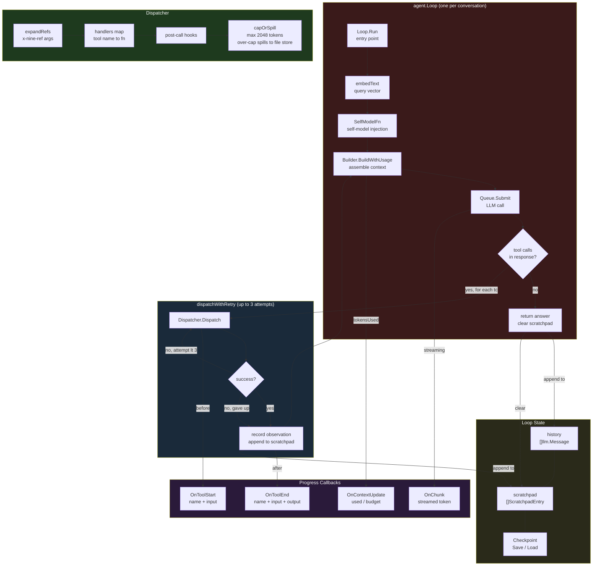
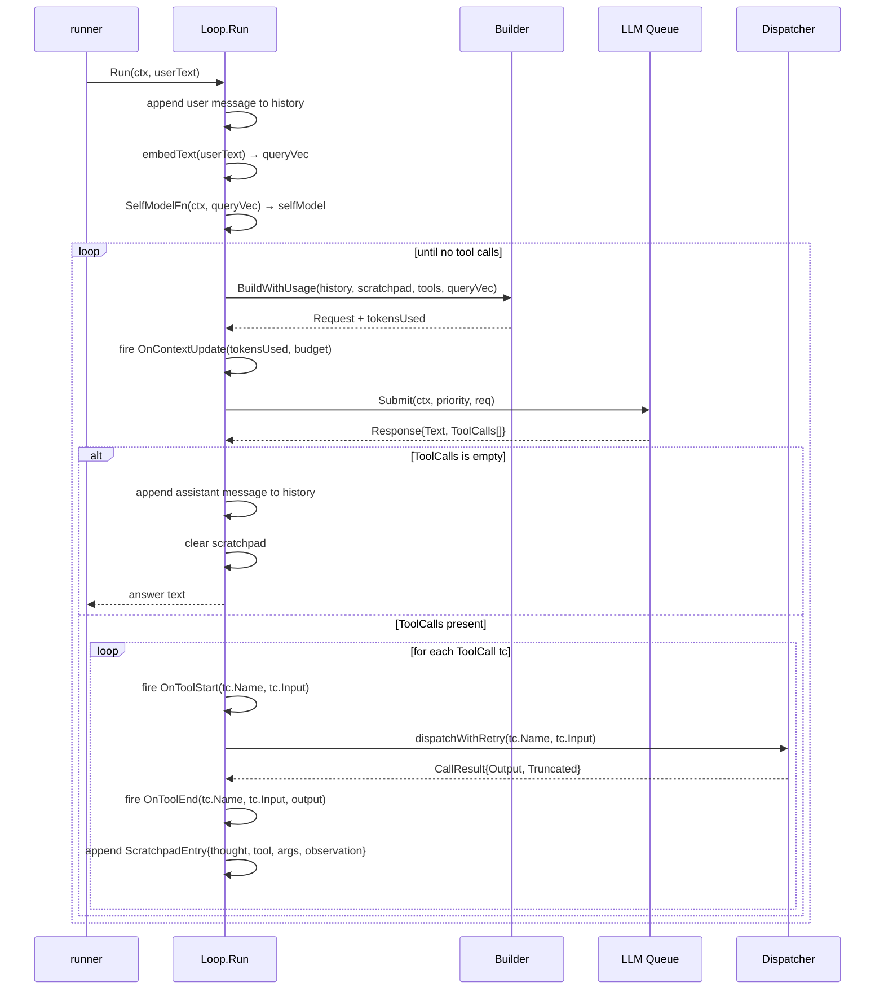

# Agent loop

The agent loop is a stateful ReAct (Reason + Act) implementation. Each `Loop` holds conversation history and a scratchpad, and iterates between LLM calls and tool dispatches until the model produces a final answer with no tool calls.

## Component diagram



## ReAct inner loop (sequence)



## Dispatcher

The `Dispatcher` is a registry of `handlers` (tool name → function). It routes every tool call, expands `x-nine-ref` arguments, runs post-call hooks, and caps output at 2048 tokens (~8 000 chars) — spilling anything larger to the file store and returning a head+tail preview naming the path ([tool-output-spill.md](tool-output.md)).

### Tool categories

| Category | Tools |
|----------|-------|
| Memory | `memory_embed`, `memory_query`, `file_search_semantic` |
| Catalog | `tool_list` (full enumeration of the advertised tool set), `tool_search`, `skill_search` (embedder-gated catalog search) |
| Sub-agents | `run_agent`, `run_agents` |
| Workflows | `workflow_create`, `workflow_get`, `workflow_update`, `workflow_list`, `workflow_retry_step` |
| Goals | `goal_create`, `goal_get`, `goal_list`, `goal_update_status` |
| Supervision | `gap_report` |
| Plugin tools | any tool registered via `RegisterPlugin` |

### Wiring model

`Dispatcher.New()` returns an **empty** dispatcher (an empty handler map). The
daemon adds handlers at startup via the `Register*` functions — only the tools a
given role is allowed to see are registered — and plugin tools are added
dynamically via `RegisterPlugin` when a plugin binary starts. There are no
pre-registered "stub" handlers; an unregistered tool name simply has no handler.

```
Dispatcher.New()                  → empty handler map
  └─ RegisterGapReport(...)
  └─ RegisterRunAgent(...) / RegisterRunAgents(...)
  └─ RegisterWorkflowTools(...)
  └─ RegisterGoalTools(...)
  └─ RegisterMemoryTools(...) / RegisterSkillTools(...)
  └─ RegisterToolSearch(...)       → tool_search (skill_search rides in RegisterSkillTools)
  └─ RegisterToolList(...)         → tool_list   (skill_list  rides in RegisterSkillTools)
  └─ ...
  └─ RegisterPlugin(mgr, plugin)  → plugin tool handlers
```

### Post-call hooks

`AddHook(toolName, fn)` registers callbacks that fire after every successful call to that tool. (Skill description embedding is done inline by the `skill_write` / `skill_modify` handlers in `RegisterSkillTools`, not via a hook.)

## Loop state

| Field | Description |
|-------|-------------|
| `history` | Accumulated `llm.Message` pairs (user + assistant). Never cleared between turns unless `ClearHistory()` is called explicitly. |
| `scratchpad` | `ScratchpadEntry` list for the current turn (thought + tool name + args + observation). Cleared on every successful final answer. |
| `lastToolCount` | Number of tool calls in the most recent `Run()`. Used by the runner for stall detection. |

### Checkpointing

`SaveCheckpoint()` serialises `history` and `scratchpad` to JSON. `LoadCheckpoint()` restores them. Called by the runner after every turn.

## Context assembly (`Builder`)

On each inner loop iteration `BuildWithUsage` assembles the full LLM request:
- System prompt: current time + session ID + `SystemCore` + `SystemExtras` + self-model
- Tool list: intercepted tools (always included) + plugin tools ranked by `queryVec` relevance
- History: trimmed to fit the context budget
- Scratchpad: current turn's observations

`OnContextUpdate` fires with `(tokensUsed, budget)` after each assembly. When usage
crosses 90% of the budget, the loop also emits a one-shot `notice` warning that the
oldest history is being trimmed to fit (re-arms once usage drops back below the
threshold). See [Context Builder](context-builder.md).

## Limits

| Limit | Detail |
|-------|--------|
| Fixed retry count | `dispatchWithRetry` makes up to three attempts with no backoff between them. A tool failing for a persistent reason costs three calls before the observation records the failure. |
| No partial-turn recovery | A checkpoint is written after a turn completes. A daemon killed mid-turn resumes from the previous turn, and the scratchpad of the interrupted turn is lost. |
| History grows unbounded | `history` is never trimmed by the loop, only by the context builder when assembling a request. A long session keeps every message in the checkpoint. |
| Output cap is global | The dispatcher caps every tool result at 2048 tokens. The cap is not per-tool, so a tool whose useful output is consistently larger always spills. |
