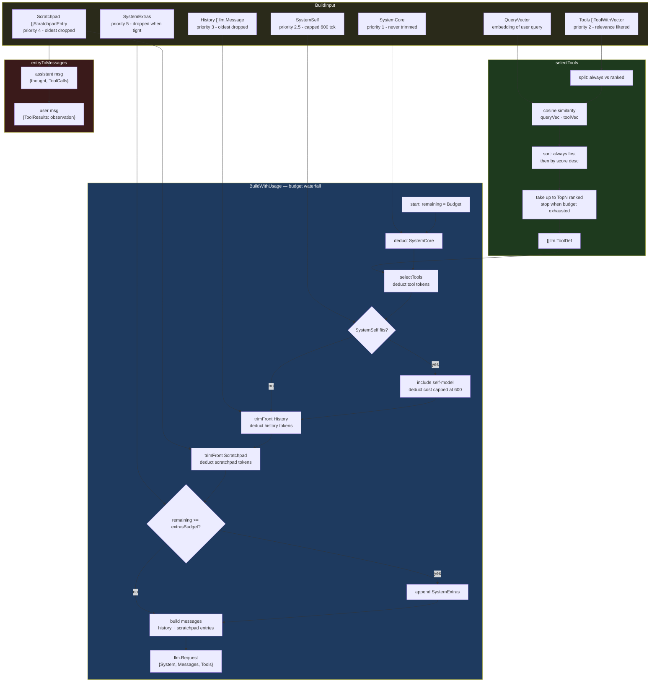

# Context Builder Architecture

The context builder (`ninectx.Builder`) assembles one `llm.Request` per inner-loop iteration, fitting conversation state into a fixed token budget using priority-based trimming and embedding-based tool ranking.

## Assembly Pipeline



## Token Budget Waterfall

Each priority level deducts from a shared `remaining` counter. Lower-priority content is dropped when the counter runs out.

```
Budget (e.g. 200 000 tokens)
  - SystemCore          [P1] always present (current time + session ID + identity)
  - Tool definitions    [P2] always-include + top-N under the cap (see note below)
  - SystemSelf          [P2.5] capped at 600 tokens; skipped if too costly
  - SystemEnrichment    [P2.6] related prior session; capped at 300 tokens; dropped first when tight (event-journal.md)
  - History messages    [P3] tail kept; oldest dropped by trimFront
  - Scratchpad entries  [P4] tail kept; oldest dropped by trimFront
  - SystemExtras        [P5] included only if remaining >= extrasBudget (default 200)
```

`BuildWithUsage` returns `(llm.Request, tokensUsed)` where `tokensUsed = Budget - remaining`.

When `tokensUsed` reaches **90%** of the budget (`contextWarnFraction`), the agent
loop emits a one-shot `notice` wire event telling the user that the oldest history
is being trimmed to fit. The notice re-arms once usage falls back below the
threshold, so a session that repeatedly brushes the ceiling is warned on each
upward crossing rather than only once. This is advisory only — the turn always
fits the budget by construction; the notice never blocks or compacts.

## Tool Selection

`selectTools` runs on every call to `BuildWithUsage`. It:

1. Splits the tool list into **always-include** (from `Config.AlwaysTools`) and **ranked**.
2. Scores ranked tools with **cosine similarity** between the query embedding and each tool's embedding. Tools with no vector get score 0. Per-tool vectors are populated by the `AgentBuilder`, which embeds each tool's `name: description` once and caches it by name (descriptions are static after boot); with `provider = "none"` there is no embedder, so vectors are nil and every tool scores 0 (ranking degrades to insertion order under the `TopN` cap).
3. Sorts: always-include tools first, then ranked tools descending by score.
4. Greedily adds ranked tools up to `TopN` (default 20), skipping any that would exceed the remaining budget.

Always-include tools are never skipped regardless of budget or score. Intercepted tools (e.g. `gap_report`, `run_agent`) are registered as always-include so they are always visible to the LLM.

## Scratchpad → Messages

Each `ScratchpadEntry` expands to two `llm.Message` values so the LLM sees the full ReAct trace:

```
ScratchpadEntry { Thought, ToolName, ToolCallID, ToolArgs, Observation }
  →  assistant msg: { Text: Thought, ToolCalls: [{ID, Name, Input}] }
  →  user msg:      { ToolResults: [{ToolCallID, Content: Observation}] }
```

Entries with no `ToolName` produce only the assistant message (pure thought, no tool call).

## Token Counting

All token estimates use a **4 chars ≈ 1 token** approximation, consistent with Claude model tokenisation:

| Function | What it counts |
|----------|---------------|
| `countTokens(s)` | `(len(s) + 3) / 4` |
| `toolTokens(t)` | name + description + input schema |
| `messageTokens(m)` | text + tool call names/inputs + tool result contents |
| `scratchpadTokens(e)` | thought + observation + tool name/args |

## Config Defaults

| Field | Default | Effect |
|-------|---------|--------|
| `ToolTopN` | 20 | Max ranked (non-always) tools included |
| `ExtrasBudget` | 200 tokens | Min remaining budget to include `SystemExtras` |
