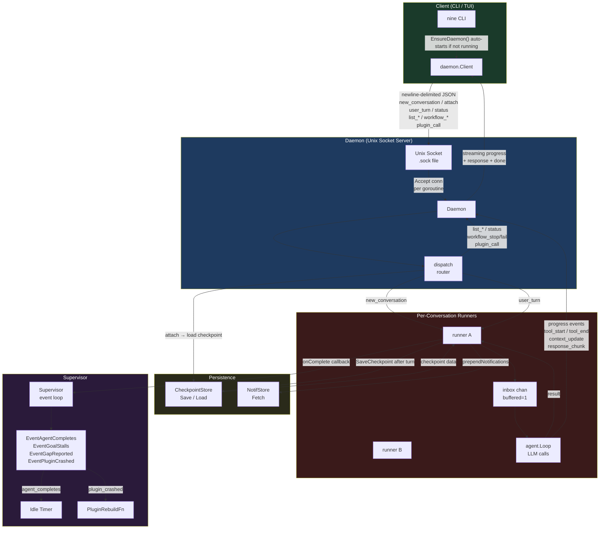

# Daemon

The daemon is a Unix-socket server that routes user turns to per-conversation agent loops and persists state via checkpoints.

## Component Diagram

## Key Flows

### 1. Startup
`EnsureDaemon` auto-forks the process if no daemon is reachable on the socket; the client then connects over the Unix socket.

### 2. Conversations
- `new_conversation` — creates a `runner` with a fresh `agent.Loop`
- `attach` — restores a runner from the `CheckpointStore` if not already in memory

### 3. Turn Processing
`user_turn` queues into the runner's `inbox` channel (capacity 1, serializing turns). The runner:
1. Prepends any pending notifications from `NotifStore`
2. Runs the LLM loop via `agent.Loop.Run`
3. Checks for stall (consecutive no-tool turns)
4. Saves a checkpoint to `CheckpointStore`
5. Calls `onComplete` callback

### 4. Streaming Progress
While the loop runs, events flow back to the client in real time:
- `tool_start` / `tool_end` — tool call lifecycle with input/output
- `context_update` — context window usage
- `response_chunk` — streamed text tokens
- `thinking_chunk` — streamed reasoning tokens (when `[llm] thinking` is enabled)

The final `response` + `done` messages are sent once the turn completes.

### 5. Supervisor
Receives events asynchronously from runners:
- `EventAgentCompletes` — resets the idle timer
- `EventGoalStalls` / `EventGapReported` — reserved for gap/stall handling
- `EventPluginCrashed` — calls `PluginRebuildFn` to restart the plugin

### 6. Direct Dispatch (no runner)
These message types are handled synchronously in the dispatch loop:
- `status` — uptime, active agents, loaded plugins
- `list_goals` / `list_reflections` / `list_workflows`
- `workflow_stop` / `workflow_fail`
- `list_tools` — all available tools grouped by plugin
- `plugin_call` — bypasses the LLM, calls a tool directly: core-intercepted tools
  (`memory_*`, `file_*`, `skill_*`, `doc_*`) through the daemon's core dispatcher,
  everything else through the owning plugin

## Protocol

All messages are newline-delimited JSON (`Msg` struct). The full message type reference and the client used by the CLI/TUI live in `protocol`, kept separate from the daemon implementation so client code doesn't pull in the whole runtime.

## Source Files

| File | Responsibility |
|------|---------------|
| `daemon.go` | Unix socket server, connection handling, dispatch |
| `session_worker.go` | Per-conversation agent loop wrapper, stall detection, checkpointing |
| `supervisor.go` | Async event handling, idle timer, plugin rebuild |
| `store.go` | SQL-backed `CheckpointStore` and `NotifStore` implementations |

The wire protocol and client live in `protocol`:

| File | Responsibility |
|------|---------------|
| `protocol.go` | Shared types: `Msg`, `ProgressEvent`, `StatusInfo` |
| `client.go` | Client-side dial, `EnsureDaemon`, typed request methods |
