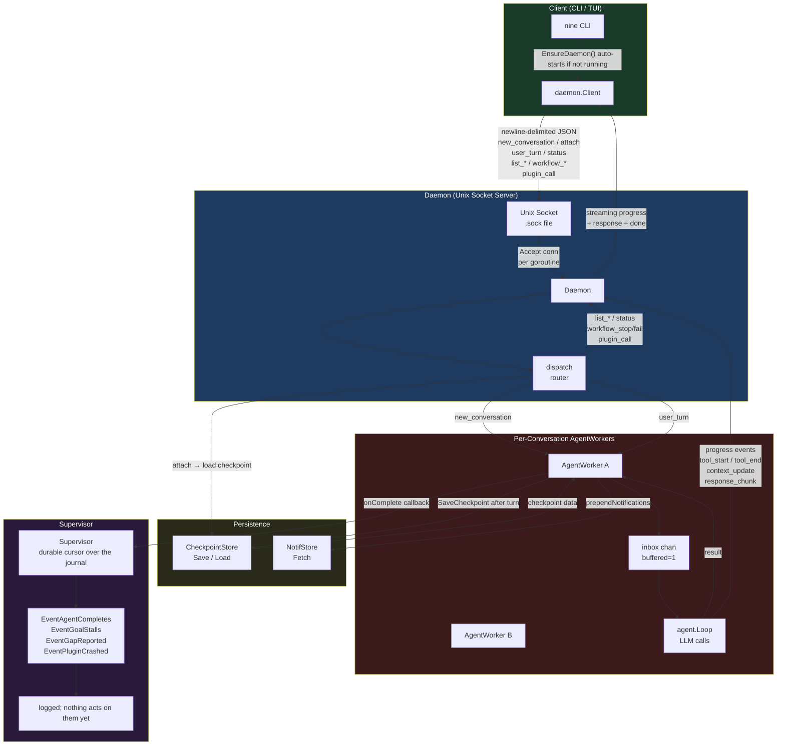

# Daemon

The daemon is a Unix-socket server that routes user turns to per-conversation agent loops and persists state via checkpoints.

## Component diagram

## Key flows

### 1. Startup
`EnsureDaemon` auto-forks the process if no daemon is reachable on the socket; the client then connects over the Unix socket.

### 2. Conversations
- `new_conversation` — creates an `AgentWorker` with a fresh `agent.Loop`
- `attach` — restores a worker from the `CheckpointStore` if not already in memory

### 3. Turn processing
`user_turn` queues into the worker's `inbox` channel (capacity 1, serializing turns). The worker:
1. Prepends any pending notifications from `NotifStore`
2. Runs the LLM loop via `agent.Loop.Run`
3. Checks for stall (consecutive no-tool turns)
4. Saves a checkpoint to `CheckpointStore`
5. Calls `onComplete` callback

### 4. Streaming progress
While the loop runs, events flow back to the client in real time:
- `tool_start` / `tool_end` — tool call lifecycle with input/output
- `context_update` — context window usage
- `response_chunk` — streamed text tokens
- `thinking_chunk` — streamed reasoning tokens (when `[llm] thinking` is enabled)

The final `response` + `done` messages are sent once the turn completes.

### 5. Supervisor
Receives events asynchronously, through a durable cursor over the journal so a
posted event survives a restart. **Every event is logged and nothing acts on any
of them yet** — the handler's switch is where a reaction would plug in:

- `EventAgentCompletes`, `EventGoalStalls`, `EventGapReported` — logged
- `EventPluginCrashed` — logged; restarting the subprocess is the plugin
  manager's responsibility, and no agent-reachable path rebuilds a plugin
  (R-PLUG.7)

### 6. Direct dispatch (no runner)
These message types are handled synchronously in the dispatch loop:
- `status` — uptime, active agents, loaded plugins
- `list_goals` / `list_reflections` / `list_workflows`
- `workflow_stop` / `workflow_fail`
- `list_tools` — all available tools grouped by plugin
- `plugin_call` — bypasses the LLM, calls a tool directly: core-intercepted tools
  (`memory_*`, `file_*`, `skill_*`, `doc_*`) through the daemon's core dispatcher,
  everything else through the owning plugin

## Protocol

All messages are newline-delimited JSON (`Msg` struct). The full message type reference and the client used by the CLI/TUI live in `protocol`, kept separate from the daemon implementation so client code doesn't pull in the whole runtime.

## Source files

| File | Responsibility |
|------|---------------|
| `daemon.go` | Unix socket server, connection handling, dispatch |
| `agent_worker.go` | Per-conversation agent loop wrapper, stall detection, checkpointing |
| `supervisor.go` | Async event intake over a durable journal cursor |
| `store.go` | SQL-backed `CheckpointStore` and `NotifStore` implementations |

The wire protocol and client live in `protocol`:

| File | Responsibility |
|------|---------------|
| `protocol.go` | Shared types: `Msg`, `ProgressEvent`, `StatusInfo` |
| `client.go` | Client-side dial, `EnsureDaemon`, typed request methods |

## Limits

| Limit | Detail |
|-------|--------|
| Local clients only | The daemon listens on a Unix socket, so every client runs on the same host, with no authentication and no transport security on that socket. Reaching it over the network means running `nine api`, which has its own auth ([api.md](api.md)) and translates to this same socket. |
| One turn at a time per conversation | Each worker's inbox has capacity 1, so turns are strictly sequential within a conversation. Concurrency is across conversations, not within one. |
| No supervisor reactions | All four events are delivered and logged; nothing acts on them. A crashed plugin is the manager's to restart. |
| No graceful client resume | A client that disconnects mid-turn loses the progress stream. The turn completes and is checkpointed, but the streamed output is not replayed on reattach. |
