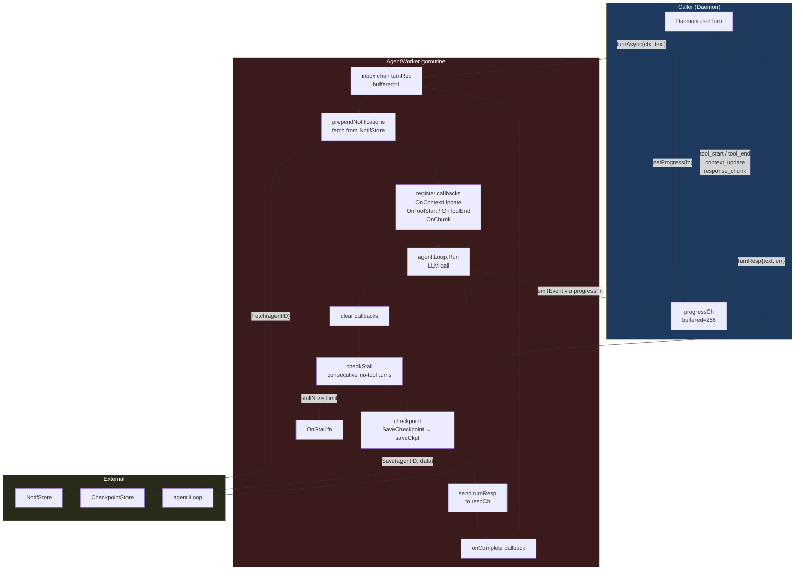
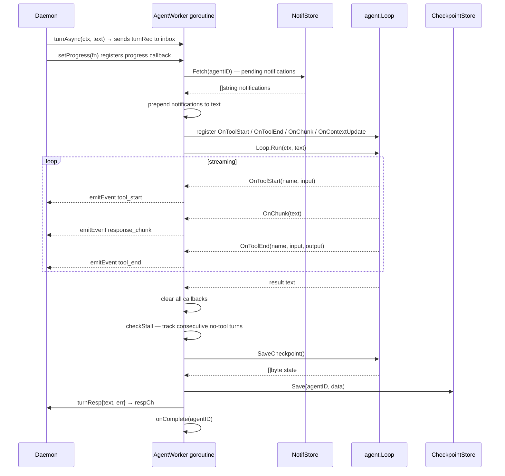

# AgentWorker

An `AgentWorker` wraps a single `agent.Loop` and serializes user turns for one
conversation or background session. Each worker owns a goroutine that processes
turns one at a time from an inbox channel.

## Component diagram



## Turn lifecycle



## End-of-turn hooks

After `agent.Loop.Run` returns, the worker runs four hooks in order, and the
order matters: a stall has to be seen before the routines are notified, because
`OnTurnEnd` is how a pursue routine learns to pause its goal.

1. **Stall detection** — see below.
2. **Routine `OnTurnEnd`** — every active routine on the session plan, which is
   where a goal's status is synced ([session-plans.md](session-plans.md)).
3. **Checkpoint** — serialize loop state and persist it.
4. **Re-arm the idle scheduler** — compute the next wake across the session's
   idle-capable routines.

A turn also carries two things on its context rather than taking them from boot
configuration, because the sandboxed-tool host is daemon-wide: the journal
destination for a tool's outbound HTTP, and the conversation a
`scope = "conversation"` state grant resolves against.

Queued messages are drained here too — a message sent while the worker was busy
is folded into the next turn rather than starting one
([queued-messages.md](queued-messages.md)).

## Stall detection

The AgentWorker tracks consecutive turns where `agent.Loop.LastRunToolCount() == 0`. When `stallN` reaches `StallConfig.Limit`, `OnStall` fires and the counter resets.

```
turn completes
  └─ tools used > 0 → stallN = 0
  └─ tools used == 0 → stallN++
       └─ stallN >= Limit → OnStall(agentID), stallN = 0
```

Stall detection is disabled when `Limit == 0` or `OnStall == nil`.

## Concurrency model

- The inbox channel has capacity 1. The daemon blocks sending a new turn until the current one finishes, making turns strictly sequential per worker.
- `progressFn` is guarded by a mutex so the daemon goroutine can register/clear it while the AgentWorker goroutine calls it.
- `stop()` closes the inbox and blocks on `<-stopped`, ensuring the goroutine drains cleanly before the worker is discarded.

## Key methods

| Method | Description |
|--------|-------------|
| `newAgentWorker` | Creates the worker and starts the goroutine |
| `turnAsync` | Non-blocking submit; returns a `chan turnResp` |
| `turn` | Blocking submit; wraps `turnAsync` |
| `stop` | Closes inbox, waits for goroutine to exit |
| `setProgress` | Registers/clears the streaming progress callback |
| `emitEvent` | Thread-safe progress event emission |
| `prependNotifications` | Fetches pending notifs and prepends them to the message |
| `checkStall` | Increments/resets stall counter; fires `OnStall` at threshold |
| `checkpoint` | Serializes loop state and persists via `saveCkpt` |
| `setDrainQueued` | Installs the hook that folds queued messages into the next turn |

## Limits

| Limit | Detail |
|-------|--------|
| Stall detection is heuristic | A stall is counted as consecutive turns using no tools. A session legitimately reasoning without tools across several turns looks identical to a wedged one. |
| Stall detection is off by default in tests | `Limit == 0` or `OnStall == nil` disables it entirely. |
| Checkpoint granularity is one turn | State is serialized after a turn completes. A daemon killed mid-turn resumes from the previous turn and loses that turn's scratchpad. |
| Progress buffer can drop | `progressCh` is buffered at 256 events. A turn emitting faster than the client consumes can overflow it. |
| The replay ring is bounded | Each worker keeps the last 200 tool and sub-agent events for a reattaching client and sends at most 50. A longer disconnection loses the earliest of them, and `response_chunk` events are never buffered, so the text stream itself is not replayed. |
| No per-turn timeout | The worker blocks on `agent.Loop.Run` for as long as the loop takes. Bounding a turn is the loop's and the LLM queue's job, not the worker's. |
