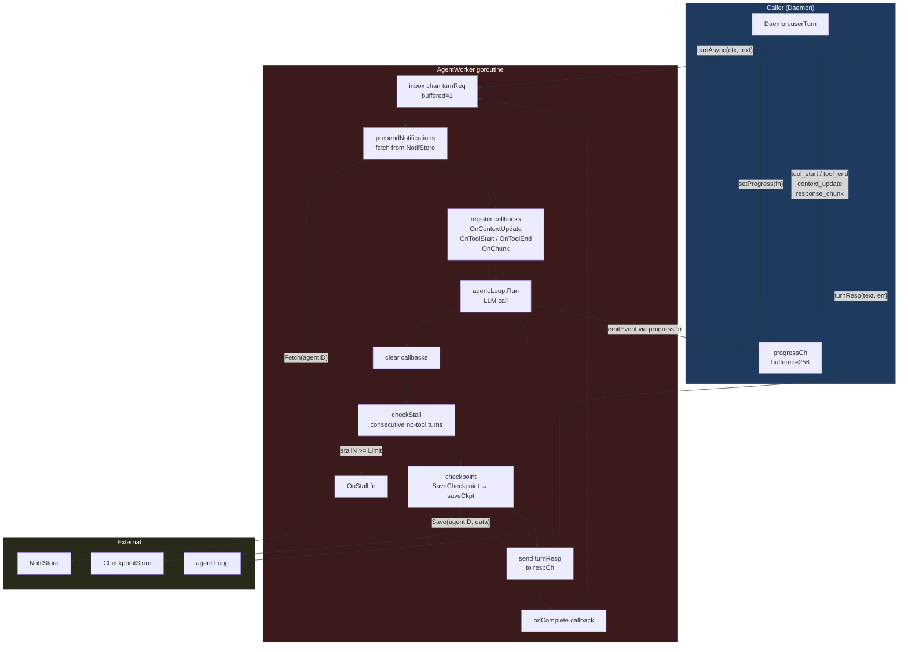
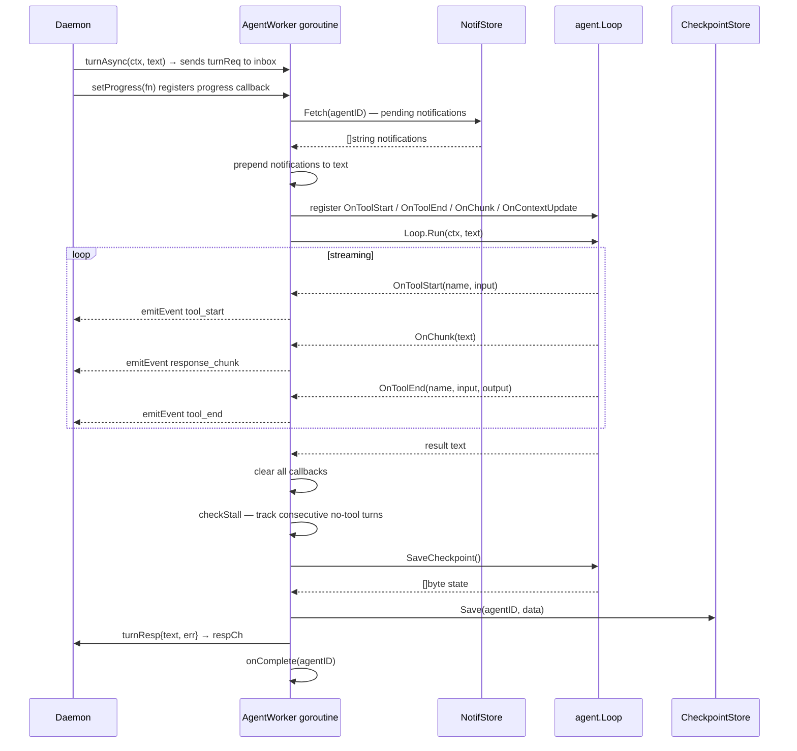

# AgentWorker

An `AgentWorker` wraps a single `agent.Loop` and serializes user turns for one
conversation or background session. Each worker owns a goroutine that processes
turns one at a time from an inbox channel.

## Component Diagram



## Turn Lifecycle



## Stall Detection

The AgentWorker tracks consecutive turns where `agent.Loop.LastRunToolCount() == 0`. When `stallN` reaches `StallConfig.Limit`, `OnStall` fires and the counter resets.

```
turn completes
  └─ tools used > 0 → stallN = 0
  └─ tools used == 0 → stallN++
       └─ stallN >= Limit → OnStall(agentID), stallN = 0
```

Stall detection is disabled when `Limit == 0` or `OnStall == nil`.

## Concurrency Model

- The inbox channel has capacity 1. The daemon blocks sending a new turn until the current one finishes, making turns strictly sequential per worker.
- `progressFn` is guarded by a mutex so the daemon goroutine can register/clear it while the AgentWorker goroutine calls it.
- `stop()` closes the inbox and blocks on `<-stopped`, ensuring the goroutine drains cleanly before the worker is discarded.

## Key Methods

| Method | Description |
|--------|-------------|
| `newAgentWorker` | Creates the worker and starts the goroutine |
| `turnAsync` | Non-blocking submit; returns a `chan turnResp` |
| `turn` | Blocking submit; wraps `turnAsync` |
| `stop` | Closes inbox, waits for goroutine to exit |
| `setProgress` | Registers/clears the streaming progress callback |
| `emitEvent` | Thread-safe progress event emission |
| `prependNotifications` | Fetches pending notifs and prepends them to the message |
| `checkStall` | Increments/resets stall counter; fires `OnStall` at threshold |
| `checkpoint` | Serializes loop state and persists via `saveCkpt` |
